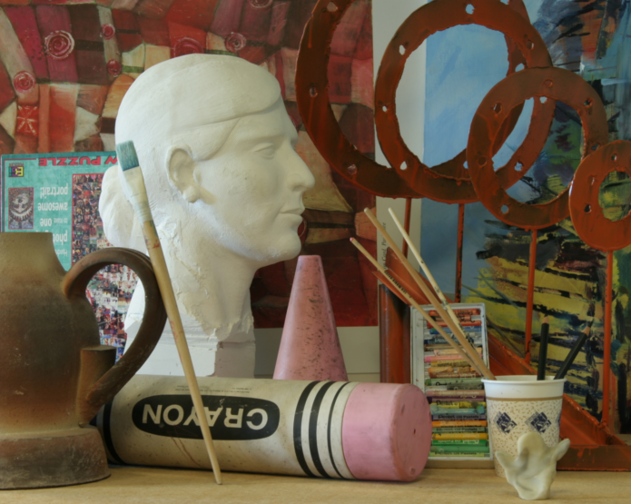
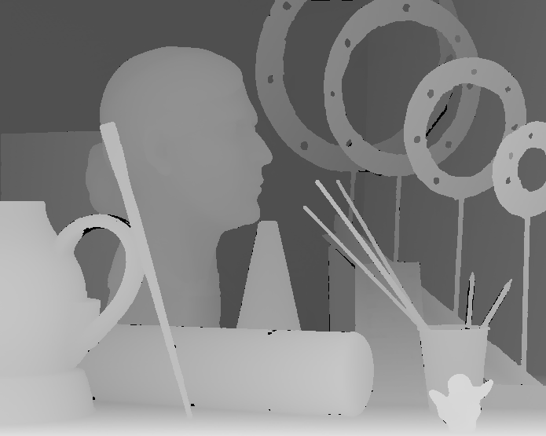
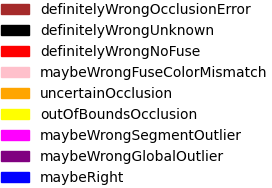

This is a testing framework for stereo matching algorithms. *This work has been patented.*

# Examples of 3D Images
See `inputs` for an assorted test bed of 3D images. 

# Testing Disparity Maps

## Executable: `testDisparityMap.py`

### *To run:*

Set your preferred segmentation method in `config.py`. 

If your disparity maps are RGB image files (e.g., PNG, JPEG), set the `dispType` parameter to "RGB". If your disparity maps are PGM or PFM files, set `dispType` to "PGM" or "PFM". If your disparity maps are grayscale images, set `dispType` to "GRAY".
```
python3 testDisparityMap.py [dispType: RGB | PGM | PFM | GRAY] <leftDispMapFile> <rightDispMapFile> <leftOriginalImage> <rightOriginalImage> <dispMapScoreOutputFile> <optional|segmentFile>
```

### *Examples:*
```
python3 testDisparityMap.py GRAY inputs/art/input/left_disparity_art_bad.png inputs/art/input/right_disparity_art_bad.png inputs/art/art_L.png inputs/art/art_R.png inputs/art/output/left_disparity_art_bad_score.png inputs/art/segments.txt
```

```
python3 testDisparityMap.py PFM inputs/artroom1/input/left_disparity_artroom1.pfm inputs/artroom1/input/right_disparity_artroom1.pfm inputs/artroom1/left_artroom1.png inputs/artroom1/right_artroom1.png inputs/artroom1/output/left_disparity_artroom1_score.png inputs/art/segments.txt
```

Original image             |  Disparity map            |  Score                    | Legend
:-------------------------:|:-------------------------:|:-------------------------:|:-------------------------:
  |    |   | 


### *Overview:*
Produces a visual score in the form of a color-coded image. 

Given a disparity map, `testDisparityMap` will:
1. Identify definitively wrong disparities if they result in definitive errors. Pixels in unknown regions of the disparity map are black, and always wrong. Pixels may encode occlusion in the wrong direction. Pixels may not fuse properly.
1. Segment the image based on both edges and color.
1. Extract all of the pixels from the image and disparity map that belong to a given segment. Consider all the disparities associated with that segment, keeping in mind that disparities should be continuous. Identify all the discrete, consecutive/contiguous disparity groups within the segment. If any group stands out from the rest, mark those disparities as potential outliers.
1. Repeat the previous step on the entire disparity map to identify potential global outliers.
1. Assign each pixel a color-coded score. Output an image based on the disparity map where the color of each pixel reflects the likelihood that the pixel is wrong.
1. Perform correction, using RANSAC plane fitting.


## Executable: `computeDisparityMapScore.py`

### *To run:*

```
python3 computeDisparityMapScore.py <dispMapScoreOutputFile>
```

### *Examples:*
```
python3 computeDisparityMapScore.py inputs/art/output/left_disparity_art_bad_score.png
```

### *Overview:*
Produces a numerical score.

# Generating Disparity Maps With OpenCV

## *Executable:* `generateDisparityMaps.py`

### *Example:*
```
python3 generateDisparityMaps.py inputs/aloe/aloe_L.png inputs/aloe/aloe_R.png inputs/aloe/opencv1/left_disparity_aloe.png inputs/aloe/opencv1/right_disparity_aloe.png
```

### *Overview:*

Generates a disparity map using OpenCV's StereoBM and StereoSGBM methods.

